# DSDⅡ直通车 24/25 WS

请尽可能使用**电脑**浏览此文档，移动平台可能会出现显示错位等问题。
全文的**目录**、**粗体蓝字**均有超链接。
收录我个人申请途中的亲身经历。
**请务必注意信息的时效性，某些信息可能已过时！！！**

## 写在前面

在2024年6月24号这天，我收到了高考成绩的EMS快件，准备前往公证处，出发前想进一步了解相关流程和时间规划，只觉缺少一份详细的介绍申请季的材料，于是着手编写此文件，旨在填补此方面的空白。 
​由于内容的时效性、准确性及可重复性都存在疑问，我在此真诚邀请所有看到此文档的，有志愿加入后续编写补充的能人志士们，一起补充曹杨二中DSDII项目的最后一块拼图，无痛化德语理工班项目“登国际舞台”的最后一步。 
​有相关兴趣的可联系我的邮箱：luthwig@outlook.com，或者通过博客右侧的邮件。

2025年4月4日
  

张天力

------

## 具体时间表与流程

| 月份 | 日期 | 行为                                                         |
| ---- | ---- | ------------------------------------------------------------ |
| 6月  | 21日 | 领取DSD证书+校内成绩                                         |
|      |      | 申请Warteliste，[此处链接](https://service2.diplo.de/rktermin/extern/choose_realmList.do?locationCode=shan&request_locale=de)供跳转 |
|      | 24日 | EMS送达高考成绩                                              |
|      |      | 前往[东方公证处](https://www.sh-notary.org.cn/)公证三样大件  |
|      |      | 收到7月23日的Warteliste，嫌早遂取消                          |
|      | 28日 | 二进宫申请Warteliste                                         |
|      | 29日 | 收到8月6日的Warteliste，心满意足地保留了                     |
|      | 30日 | 汇总整理完全部材料，准备线上填报与寄出                       |
| 7月  | 1日  | 领取公证件                                                   |
|      | 3日  | 当天中午完成所有【Jena, TUM, RWTH】线上填报，整理完成寄出材料 |
|      |      | 当天下午收到Jena的Zulassung【这就是耶拿速度】                |
|      | 4日  | 通过DHL向uni-assist与LMU寄出线下材料【后得知ua不用寄，大家别学我浪费几百块钱】 |
|      | 8日  | 收到了RWTH的Zulassung，隔四天才发，糊弄鬼呢，不去你。        |
|      |      | 同日，DHL送达                                                |
|      | 20日 | 注册Fintiba平台，与家长沟通准备保证金                        |
|      | 23日 | 存入保证金&办理保险 [**【详见后文中‘保证金保险类’】**](#保证金保险类) |
|      | 24日 | 收取保证金证明&保险证明                                      |
|      | 25日 | 当日中午收到了LMU的Zulassung，宝你真好，才20天就要我。       |
|      |      | 同日，德方上调了保证金934-992/Monat，着手重新汇款            |
|      | 26日 | 完成第二次汇款                                               |
|      | 29日 | 上午工行通知说“分行技术原因”汇款失败，重新填写               |
|      |      | 中午13时去工行完成第二次汇款                                 |
|      |      | 下午17时汇款到账，得到证明                                   |
| 8月  | 6日  | 前往德国领事馆办理签证 [**【大致流程见下文‘面签’】**](#面签) |
|      | 9日  | 以为已经倒闭的Uni-assist发来了VPD，上传至TUM官网。           |
|      |      | 注：Outlook邮箱前前后后将我的四封重要邮件塞进了垃圾邮件里， **请务必定期检查！！！** |
|      | 10日 | 七夕节捏                                                     |
|      | 12日 | 当日中午收到了TUM的Zu，学费死贵还不给物理专门设系，不去你。  |
|      | 24日 | 终于想起来自己LMU要入学注册，填写了下资料后准备寄出 [**【见后文‘LMU注册流程’】**](#LMU注册流程) |
|      | 25日 | LMU入学注册文件寄出                                          |
|      | 30日 | 收到LMU的确认注册邮件                                        |
| 9月  | 3日  | 收到LMU的完成入学注册证明                                    |
|      | 10日 | 收到了签证                                                   |

至此，24/25WS申请季落下了帷幕。

------

###  面签

有人会问，如果我的心仪学校还没给我录取通知书，但已经收到了其他学校的通知书，是否能去办理签证。答案是很微妙的，理论上不行，但执行上，按24届经验，是可以的。尤其是针对慕尼黑的两所，发送录取通知书的时间都很靠后（八月中旬），大家会拿亚琛的录取通知书去面签。

在收到了Wartelist给的Termin后，D2非亚琛直通车的同学们需前往德领事馆办理签证，与亚琛直通车的APS项目存在不同之处。大致流程如下：

1. 门口排队检查护照 + Termin的邮件
2. 获取寄存电子产品（手机&智能手表）的柜子钥匙
3. **取号**等待
4. 前往窗口办理

下面是需要提交的文件：

* 护照原件
* Videx上填写的表格 + 一张照片
* 饮水机旁EMS点处购买的信封（35元，不可自带）
* DSD身份认证件原件
* 其余复印件（不可用原件或公证件，必须为复印件！！！）

5. 前往6号窗口缴费（2024年8月6日为585元，现金支付，会找钱）

个人耗时大概10min上下（不计排队时间），签证官十分和蔼可亲，认识曹杨二中，还会和你闲聊。
注：请保证Videx表格中填写的学校与Zulassung的一致，且签证官也会询问你其他被录取了的学校。

### 保证金保险类

我在Fintiba平台办理了保险金服务。在网络上有关于该平台的诸多信息，我也去仔细研读了一下。首先先来概述一下这个平台的服务：<u>私立保险MAWISTA + （【可选】公立保险BARMER）</u>
作为G-高考类留学生，我们总共需要两个保险——**递签险**和**公立险**。递签险顾名思义，需在面签当天提供证明，是申请申根签证的必备品之一。而公立险十分关键，虽然在递签时不用上交证明，但大学入学是一定要公立险的，保险公司向大学会发送一个M10证明，该文件会在保险公司收到你的录取通知书后生成。
所以Fintiba内我们需要Mawista Visum此项赠送的递签保险。也可在同时办理公立保险的业务，<u>但我个人更建议自己申请一个TK的公立保险，让Fintiba只开局保证金的证明。</u>
**总结：我们需要加入MAWISTA保险计划中，但需仔细观察加入的具体类别。**

#### *保证金如何汇款*

很多种手段，支付宝/第三方平台/银行汇款……  其中银行的汇率最好。
我用我父亲的工行卡跑去工行柜台线下办理汇款，结果那里（工行）规定需本人/伴侣携带授权书，并携带结婚证。（据我所知不同分行要求也不同）
下为汇款单：

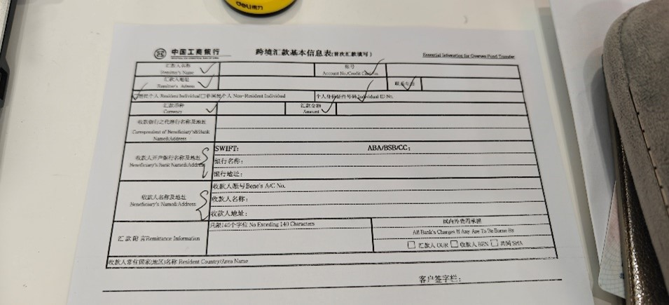
此处的ABA/BSB/CC不用填写
收款人地址填写大学/语言班地址

工行收了￥260手续费，Sutor Bank收了€20（所以汇款时比规定额度多汇点钱）

#### *公立保险*

*公立保险有很多种*，这里列出几个：
TK - Techniker Krankenkasse
DAK - Deutsche Angestellten-Krankenkasse
BARMER - Barmer Ersatzkasse
AOK  -  Allgemeine Ortskrankenkasse

四者的保费几乎差不多，TK可能每个月能便宜个位数的欧元，Barmer每个月贵个位数欧元。选取哪个可以去看每项的具体福利。但希望大家还是别生病比较好。
特别需要注意的是德国的效率较低，邮件的回信基本以隔一个工作日为基准，建议一封邮件描述具体问题直接发过去，免得来回拉扯影响心情。
以及在德国若干个月后的感触……不能和德国人好脾气说话，否则就在一直磨洋工了。建议措辞严厉些，亲测有效率提升。

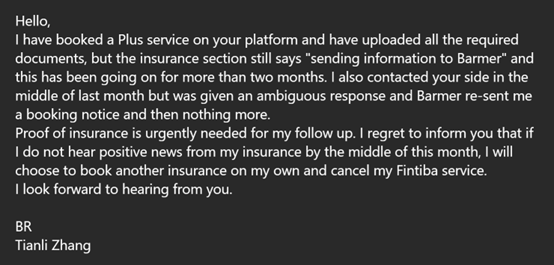
我在大学告诉我没收到保险的M10文件时立刻措辞一封发给了保险，当天下午就办成了……
 

### 四所大学的申报

这里挑选了四所我申请了并拿到了Zulassung的高校。

#### 亚琛工业大学

Rheinisch-Westfälische Technische Hochschule Aachen ，全称：北莱茵威斯特法伦州亚琛工业大学

> RWTH的HZB要求和别的学校略有差异，需上传毕业证书+校内成绩件
> RWTH的个别学科Physik & Physik Plus需要提前参与Infotag活动（类似线上的校园开放日，在高考完后再预约是来不及的，必须得提前完成，否则没大学上了就。）
> RWTH需要完成SelfAssessment，凭借完成的凭证才可申请相应学科，须注意的是别做错类别，别学24届的Philipp学长。
> 注：题非常非常简单，像趣味小学奥数，但读题很烦。 
> 亚琛的zu很快的，做题也很有趣（迫真），建议大家都做一遍申请一下。

https://online.rwth-aachen.de/
通过此链接注册账号并Bewerben，亚琛唯一比较难填的信息请参见下图。

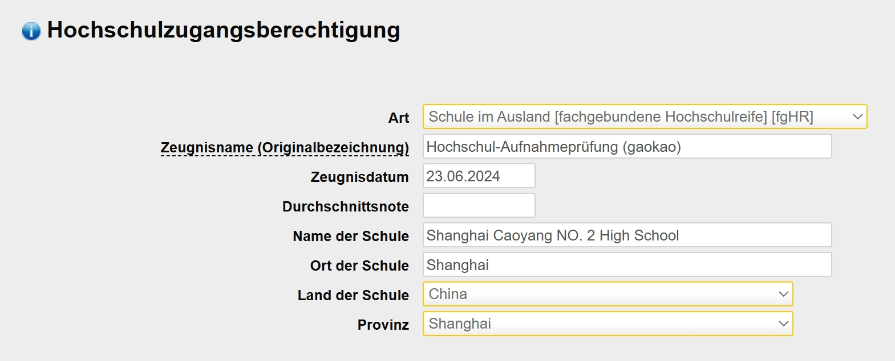
#### 慕尼黑工业大学

Technische Universität München

> TUM需要与uni-assist合作的VPD，可纯线上操作，无需额外邮寄。
> Uni-Assist - TUM
> TUM针对不同专业的提交材料要求不同，存在多种可能性。
>
> 1.	德语动机信，德语简历
> 2.	英语动机信，英语简历【winfo】
> 3.	德语简历，无需动机信【Info、ei、尊贵的Physik】
> 4.	 ……
>    【对此，请在准备材料前事先了解一下，避免失误】
>    VPD审核挺抽象的，有些人7月20号就能拿到，有些人8月10号了还没有
>

TUM与Uni-Assist（下简称UA）合作，UA负责审查我们的高考成绩与平时成绩，需在此上传我们的HZB原件及公证件，UA会着手将其转化为德国的分数制（1,0-5,0）。TUM的标准较低，基本分数优于1,7的都可以进非NC，医学比较严，考虑优于1,3。
比较特殊的学科也有Informatik，需要你上传在中学阶段的所有信息竞赛的获奖记录，他们进行审核来判断是否接受。但本科阶段几乎不做筛选，空白的履历也没事。
UA的链接：http://my.uni-assist.de/   ，需注册账号并上传信息。

TUM的的官方引导十分优秀，可以参考本页：[Onlinebewerbung für Bachelor oder Master - TUM](https://www.tum.de/studium/bewerbung/infoportal-bewerbung/onlinebewerbung/onlinebewerbung-bachelor-master)，教你一步步填写TUMonline所需的所有信息。在此我不过多赘述。

#### 耶拿大学

Friedrich-Schiller-Universität Jena ，全称：弗里德里希-席勒-耶拿大学

> 网站很一目了然，手续很简单，审核很快速。
> 注：这是东德除柏林外唯一的反AfD大城市（图林根第二大）。

大家应该对这个学校没啥兴趣。如果有对微生物和光学感兴趣的可以了解了解。至少也是欧洲第一光学研究所。

#### 慕尼黑大学

Ludwig-Maximilians-Universität München ，全称：路德维希-马克西米利安-慕尼黑大学

> 申请需邮寄，确认入学也得邮寄，高情商是古色古香，低情商是信息化程度太低。
> 感觉发zu的顺序很随机，我很晚申请（对比24届d2的卷王同学们），但却蛮早拿到了zu，可能LMU自己也不能确定收到的邮寄信件顺序，遂随机发zu。
> 小小一个时间参考：
> 我申请物理学，资料于7月8日送达，7月25日得到zu
> 成都同学申请生物信息，资料于6月30日送达，7月19日得到zu
> 注有些人可能会想来LMU的Info/BWL/VWL，这些均为受限专业，发送zu的时间节点会很靠后（8月底），并且给的注册入学时间窗口也极为小（约莫2周左右），这点需关注！
> 如果想来LMU，请申请其他大学作保底，LMU的国际化程度有点低，同学中有出现大学审核人员不认识中国流程误发拒绝信的事件。 

下展开介绍LMU的申请与注册入学。

但其实本科的择校在本质上无关紧要。德国的硕士申报重点在于课程匹配度，而不是本科大学和毕业成绩，因此专业为主，择校为辅。

##### LMU注册流程

**分两个阶段分步走：**

###### 阶段一：获得外办录取通知书

根据官网上的标准，自行准备纸质材料。
https://www.lmu.de/de/studium/internationale-vollzeit-studierende/studienbewerbung/
可以在上面链接内找寻相关资料，这里提供一个中文版的Checklist。

| Checklist                               |
| --------------------------------------- |
| 1. 下载并填写的**Antrag**（下展开说明） |
| 2. 简历                                 |
| 3. 高中毕业证书公证件                   |
| 4. 高考成绩公证件                       |
| 5. DSD身份证明（代替APS）               |
| 6. 德语证明                             |

此处的**Antrag auf Zulassung**需注意填写规范：
可填报两个志愿，但**两个志愿都需满180ECTS**。例：Info属于NC-Fach，且学分只有120/150ECTS，则需另选一/两个30/60ECTS的Nebenfach填报。

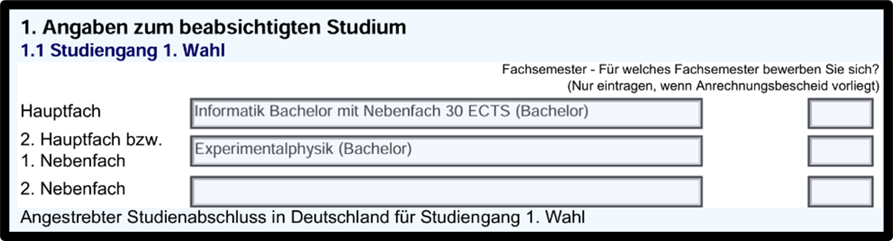
注：这里的填写并不符合要求，物理作为辅修时仅允许主修哲学，仅供格式参考，具体要求请参考专业主页。
快件送达大约两周后得到外办的Zu，顺利跨过第一关。 

###### 阶段二：注册入学

https://www.lmu.de/de/studium/internationale-vollzeit-studierende/immatrikulation/index.html
再次填写一个小小的Antrag，完成网上注册并打印证明、签名。
随Zu的复印件、护照信息页复印、DSDⅡ证书复印件在规定时间内寄送，大约送达一周后（德国人周末不上班）得到完成注册的邮件。需随邮件指导完成学生卡领取、学费缴纳等后续步骤。

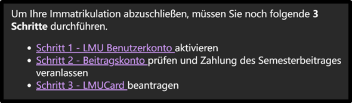
> 此处**LMUCard**需要有有效的德国地址邮寄/自取，推荐自取，可以带着Meldebescheinigung直接办好图书馆业务。
> 最后，恭喜你成为了一名光荣的LMUer，享用着比隔壁**好几个档次**的图书馆，诺贝尔奖项数量力压隔壁**十九头**。
> ~~乖，隔壁那个建校历史还没美国历史长的学校咱别上。~~
> *记得在学校的网站内领取Microsoft 365以及配套的Affinity授权（虽然使用上来感觉不如Adobe一根）

出于篇幅限制，这里只提供LMU的入学流程了，其他两所2024届D2选择的大学，暨TUM和RWTH可自行询问学长学姐，也可询问我。

##### 亚琛直通车的简略流程一览

以下内容来自2024届D2李一览学长，

> **7/18 交APS资料之前准备：**
> 学信网两份高考成绩的文件（一收到成绩就申请）
> 高中毕业证+高考成绩单（公证处公证，中+英）
> 其他都是复印件什么的
>
> **7/30 签证之前准备：**
> 经济来源证明：开自保金账户（3月19号激活的）
> 医疗保险（自保金Expatrio里包含医保TK）
> 简历，动机信，各种申请表
>
> **10/7 拿到签证**
> 之前从来没有这么久过，一般1-1.5个月

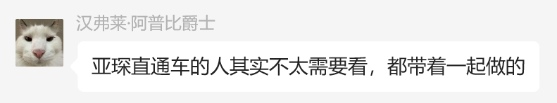
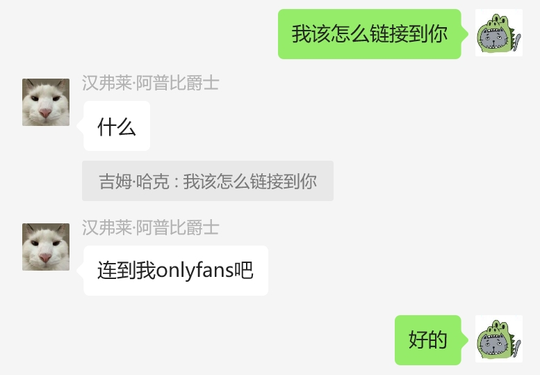
**OK**，这里是他的主页链接  ，*一个月的订阅费是10块*。

 

## 通用类解惑
### 一些学历信息的表达
可见[Länderdetails | uni-assist](https://www.uni-assist.de/tools/laenderhinweise/laenderdetails/country/cn/)与”Bewerberdaten”，此处提供些许：
| 需要给予的信息：                    | 应该填                                                       |
| ----------------------------------- | ------------------------------------------------------------ |
| Name der Hochschulaufnahmeprüfung： | Hochschulaufnahmeprüfung (gaokao)                            |
| Name des Abschlusszeugnisses:       | Abschlusszeugnis einer Fremdsprachenmittelschule mit DSD-II (12-jährig) |
| Name und Ort der Schule:            | Shanghai Caoyang NO. 2 High School; Meichuan-Str.160         |

### 我该在这些项目内传什么文件？

|                                    |                      |
| ---------------------------------- | -------------------- |
| Schulzeugnis                       | 经公证的校内成绩件   |
| Hochschulaufnahmeprüfung           | 经公证的高考成绩件   |
| Hochschulzugangsberechtigung (HZB) | 经公证的高中毕业证书 |
| Abschlusszeugnis                   | 同HZB                |

公证件并不能代表原件，请妥善保管。

### 租房中的一些术语

|                       |                                                              |
| --------------------- | ------------------------------------------------------------ |
| 可/不可an             | 指是否能在市政厅于所居住的房子[anmelden（落户）]() |
|                       | an是[办部分银行卡]()、[开合约电话卡]()等行为的前提条件。一般而言，只有长租（≥6M）可[an]()。 |
| Kalt 冷 / Warm 暖租   | Kaltmiete + Nebenkosten(inkl. 水电、暖…) = Warmmiete         |
|                       | 但一般而言GEZ（电视费）不包括在上述内。                      |
| Nach 费用             | 上一家租客留下的家具，需要出钱买下。                         |
| Möbliert/teilmöbliert | 有家具/有部分家具                                            |
| SCHUFA                | 德国的信用证明，调取你名下的德国银行卡违纪与流水，但我们暂时没有此证明。 |

**注：**网站中可能会存在骗钱的假房东，房屋的简介内有很多精美图片，但实际上只为骗钱。
虚假房东的特征——给你发的消息第二行大写；说自己人不在德国；让你先交押金；钥匙邮寄给你。各位擦亮双眼。

具体的租房流程什么的我想再开新坑讲一讲。

### 德国大学/银行/签证领馆usw. 要求我提供在德国的学期地址
以德领馆的Q&A为标准：若还没有固定下的地址，一般填你所就读大学下辖具体院系的地址，如我的：

> Ludwig-Maximilians-Universität München
> Fakultät für Physik
> Geschwister-Scholl-Platz 1
> D-80539 München

请注意，在有了固定住址（anmelden）后请尽快更改自己的地址信息。

### 下签证的时长
极其随机，递签时在你之后的也许在你拿到之前就拿到了，等一个多月也是蛮正常。我是比较早（8月6日）去的，但是特别晚（9月10日）才拿到，比较性急的一些同学当时已经飞德国了。签证官也不保证签证会在起飞前出来。尽量还是把行程最早最早安排到9月中旬，我们的亚琛直通车项目甚至是十月中才拿到的签证。
### 德语看不懂怎么办
我在此强烈推荐**“沉浸式翻译”**此浏览器插件。详谈见[下文](#附④：我看不懂德语怎么办)。
 
## 附录
### 附①：一个将校园邮箱绑定到Outlook的方法：
以LMU为例——
在Mailbox的界面里找到“Hilfe”
[Mailbox (uni-muenchen.de)](https://mailbox.portal.uni-muenchen.de/webmail/webmail/?x=DhN97h8kYhMlwj0YGqxd7Rr1DsTIknzwF8wQAaopm-6R7xcLDjL3r8gCh8LccQ1v5aJ8LAN-kOG-Zs-yc-cXpQ)

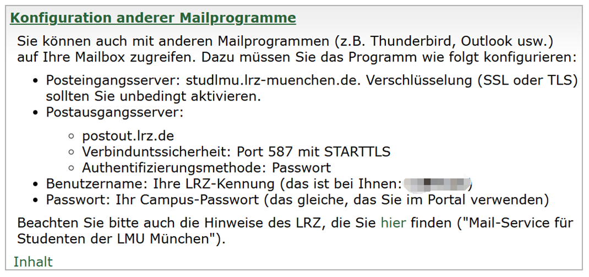
按照这里的信息填写Outlook添加账户内的IMAP，即可在手机/电脑Outlook端查看校园邮箱的收件箱，也可通过Outlook发送邮件，省的天天定时检查莫得提示的Mailbox。
但你还是得天天检查Outlook的**垃圾邮箱**、
**其他学校也同理，祝玩得开心！**
 

### 附②：我的德文输入解决方案
因Win11自带的德文输入法会更改键位，包括但不限于ZY键交换、特殊字符移位，我在此使用了一款第三方的输入法——Eurkey
它在美式键盘布局的基础上配合Alt Gr键可在原键处打出德语的äöüß等特殊字母，个人认为是在一台设备（键盘）上解决双重语言输入需求的优解，详见下图——

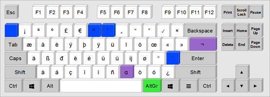
[EurKEY - The European Keyboard Layout (bruentjen.eu)](https://eurkey.steffen.bruentjen.eu/download.html)

### 附③：以*教育意义*谈科学上网
请注意，此套方案仅限于你已经完成了入学注册后，在国内有科学上网的需求。
请直接在浏览器中搜索“学校名+vpn”，学校一般都会配套有vpn的配置便于访问校内信息。
此处以LMU、TUM为例，需使用“EduVPN”此软件（在Macos、ios、Linux、Android端都有），并在验证完校内信息后勾选以下选项：

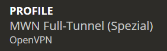
### 附④：我看不懂德语怎么办
此处我推荐将Deepseek的api与沉浸式翻译这两个结合使用。（需付费）
插件官网：https://immersivetranslate.com/zh-Hans/
官网内都有很详细的使用说明，请自行阅读。值得注意的是，官网提供的会员服务较为昂贵，我个人比较喜欢外接Deepseek的api，价格低廉而质量较高。
具体步骤：
在这个网站上完成注册或登录https://platform.deepseek.com/
购买一定数量的Tokens，50元可以用很久很久了。

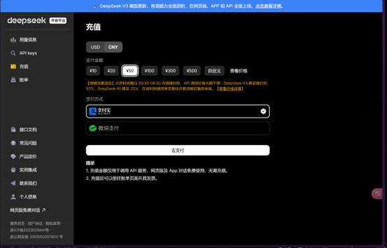
在此处创建API keys，复制所创建的API至沉浸式翻译的设置内。

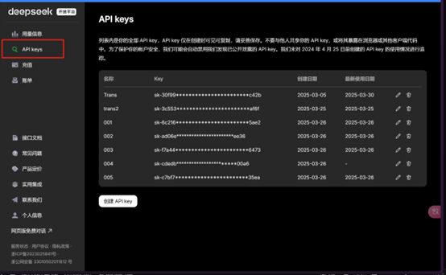
此处给与一个效果预览：（此处界面的所有中文内容均为插件翻译）

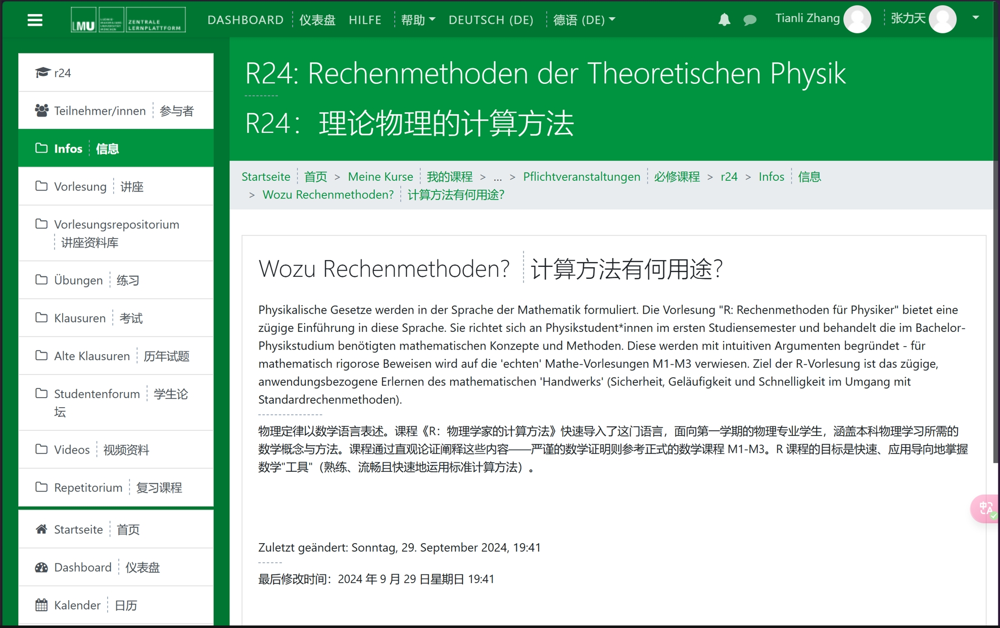
相当精准，相当快速。
 

## 结语
二中学子在德国应该是有一个不小的规模的，但不知道为什么届与届之间较缺乏联系，申请攻略也好，租房上提供的帮助也好。这里只能尽可能写下我所有过程中的试错与感想，供后人在闲暇之余翻上一番，没什么专业性，只供共情一下彼此的焦虑。
我在申请期间得到过很多陌生人的帮助，从资料投递到各种信息公开，十分感谢他们的帮助。也希望能把这份帮助继续下去。
最后，祝各位有一个充实而有趣的寒/暑假，无论是躺在沙发，开在驾校，站在厨房，还是在其余种种，这都将是很有可能的最后一/两个欢快假期了。
再最后，也希望我能学出物理学，成为熟练掌握各项元素的自然法师。

2024年9月2日
  

张天力

**一点私心**，我其实希望以后的各届学生们共同补充该直通车项目，助力再之后的毕业生。

最终，这个总耗时若干天的一年长跑项目（第一版）就此堂堂暂时完结！这在历史学科内应该能算个一手史料吧;)
再次，祝各位求学顺利！

相关慕尼黑生活分享文章：

[慕尼黑落地初期指西]() 

[慕尼黑落户指南（Anmelden）]() 

[慕尼黑延签指北]()  
