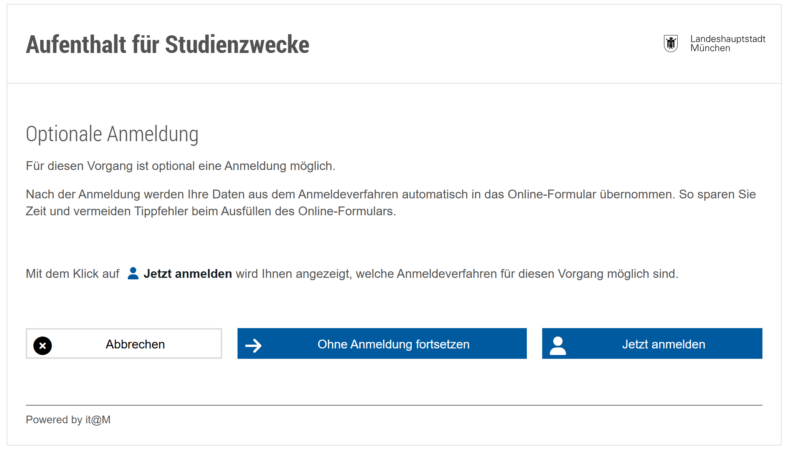
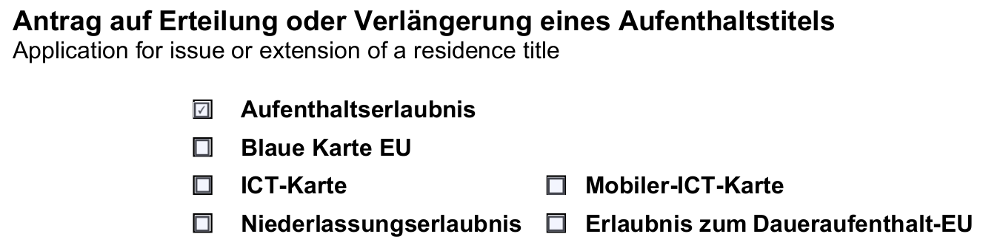
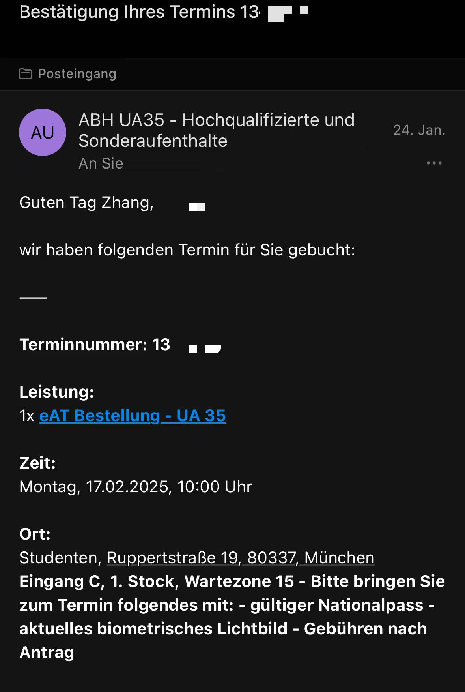
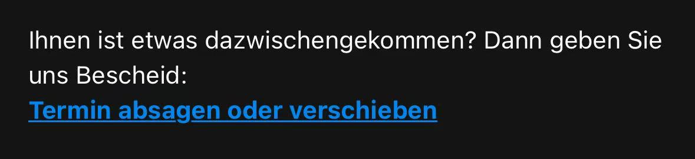
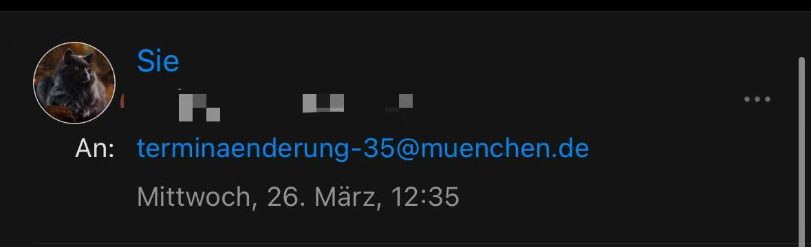
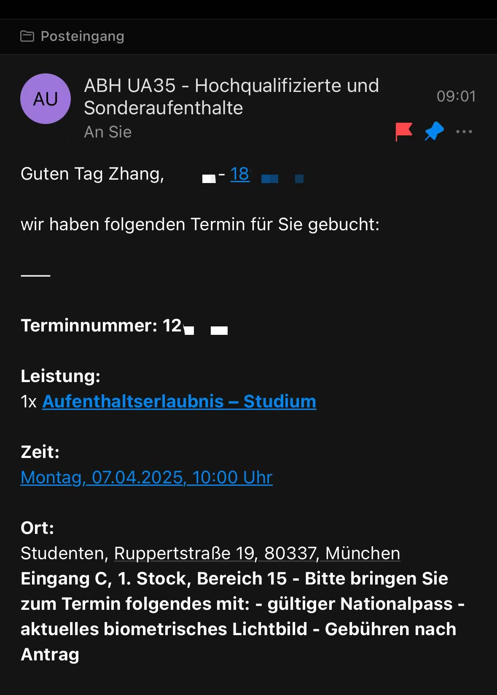

# 慕尼黑延签指东

##  背景知识

作为非欧盟公民，中国留学生（*此处不包括博士生*）在赴德留学前都需要申请D类留学签证。这是我们已经经历过的步骤了。而在德国暂时定居下来，即在Bürgerbüro办理了Anmelden的业务后，此处可参考我的“[明兴落户指南]()'”一文，我们需要着手延长我们的签证。而这涉及两条途径，也是本文的重点——申请**居留许可**Aufenthaltserlaubnis或是办理**拟制证明**Fiktionsbescheinigung。在多数中文互联网环境中（此处指小某书与某信公众号），这两者也被称为“延签”与“抢白条”。前者适用于正常的申请流程；后者则是在**办理了前者**，却仍未完成审理前，延续居留权的证明。

大概是自2024年的11或12月后，慕尼黑更新了自己原先的Anmelden/延签系统，取消了很多之前的工作邮箱（见下文叙述），一律用沟槽的Kontaktformular，回复周期比我的Nachklausur都长，带来了诸多不便，在此简单分享下我自己的摸索经历罢。

## 申请居留许可

作为学生（博士生是工作签证，不适用于本条），我们需要在[此网站](https://stadt.muenchen.de/service/info/studenten/1089339/#:~:text=K%C3%B6nnen%20Sie%20zu%20diesem%20Zweck%20visafrei%20einreisen%2C%20m%C3%BCssen,die%20ben%C3%B6tigten%20Unterlagen%20online%20oder%20per%20Post%20ein.)上提交材料申请居留许可，点击首页内蓝色方框中的“[Online beantragen](https://service.muenchen.de/intelliform/forms/01/02/02/kontaktabhaufenthaltfuerstudienzwecke/index)”后，下划至页面底端点击“Starten”。

这时，会显示以下页面，邀请你注册BayernID，推荐前往跳转页面进行注册，会在有进一步提醒时通过邮箱提醒你。

在完成后会进入提交各类材料的页面。请按我所写的内容进行选择/填写。

|                                                              |                        |
| ------------------------------------------------------------ | ---------------------- |
| Werden Sie vertreten (anwaltlich, Relocation oder gesetzliche Betreuung)? | Nein                   |
| Bitte Zutreffendes auswählen:                                | Studium/ Studienkolleg |
| Finanzieren Sie mit Ihrer Arbeit Ihren Lebensunterhalt?      | Nein                   |
| Im welchem Semester befinden Sie sich?                       | Semester 1-3           |

下方会要求上传一些材料，包括——

|                     |                                                              |
| ------------------- | ------------------------------------------------------------ |
| Antragsformular     | 下载并填写的一个[表格](https://stadt.muenchen.de/dam/jcr:c38c3e57-d9ed-4917-b2b5-229f7f008e4c/antragaufaufenthaltstitel.pdf)，后文展开谈论 |
| Nationalpass        | 你的护照首页&签证页（需包含入境章）                          |
| Immatrikulation     | 大学的**注册证明**，LMU的可在[此页面](https://qissos.verwaltung.uni-muenchen.de/qisserversos/rds?state=change&type=1&moduleParameter=studentReportsMenu&nextdir=change&next=menu.vm&xml=menu&purge=y&subdir=qissos/reports&menuid=qissosreportsPublish&breadcrumb=qissosreports&breadCrumbSource=menu)下找到 |
| Krankenversicherung | 保险证明，可在保险的APP中找到                                |
| Lebensunterhalt     | 你的自保金证明/家长的出资证明（需公证）                      |

在下一个页面中，填写你的个人信息，需要注意Staatsangehörigkeit需填写“Chinesisch”而非“China”，香港、台湾、澳门有单独的填写要求，具体请自行查看。

###  表格填写

请务必使用电脑填写该表格！若没有Adobe的Acrobat Reader应用，请选择Edge或Chrome浏览器打开最佳。

请使用鼠标勾选“Aufenthaltserlaubnis”此项。

我们按1-10的板块来看：

1. Angaben zur Person
   大致不会遇到填写障碍，如实填写就行。
2. Angaben zur Einreise und zu Voraufenthalten

|                                                              |                                                    |
| ------------------------------------------------------------ | -------------------------------------------------- |
| Erstmalige Einreise in das Bundesgebiet                      | 填写你的入境德国时间，请注意飞机的隔天和时差问题。 |
| Ich bin ohne Unterbrechungen in Deutschland seit             | 我们空着不填。                                     |
| Auslandsaufenthalte von mehr als sechs Monaten               | 我们空着不填。                                     |
| Frühere Aufenthalte in Deutschland                           | 填写你所有赴德旅行的信息。                         |
| Wurden Sie bereits aus Deutschland  oder einem anderen Schengen-Staat  ausgewiesen, abgeschoben oder  zurückgeschoben? | 勾选"Nein"                                         |
| Wurde bereits ein Antrag auf Aufenthaltstitel abgelehnt?     | 勾选"Nein"                                         |
| Wurde ein Einreiseantrag abgelehnt?                          | 勾选"Nein"                                         |
| Sind Sie im Besitz einer Erlaubnis für langfristig Aufenthaltsberechtigte, die von einem anderen EU-Mitgliedsstaat ausgestellt wurde? | 勾选"Nein"                                         |
| Sind oder waren Sie im Besitz einer  Blauen Karte EU, die von einem  anderen EU-Mitgliedsstaat ausgestellt wurde? | 勾选"Nein"                                         |

注：此处仅适用于**一般人**，若你确实拥有欧盟蓝卡/国籍，请如实填写。*不过都这样了谁还来德国留学啊喂。*

3. Rechtsverstöße

我们都勾选”Nein“，除非你刚落地德国就惹事了。

在这里提醒各位，德国的[**武器法**](https://www.gesetze-im-internet.de/waffg_2002/anlage_2.html)很严格，请不要在公共场所携带任何性质的武器，包括刀具和钝器。任何性质的都禁止随身携带！曹二某不愿透露姓名的学长因为携带**指虎**（请参见§ 2 Absatz 3）被安检查出，被德国警察带走录入指纹并告知等待法院通知。虽然此类行为不会记录在案，但是会有几百欧元的罚款与心累的法院通知。

4. Angaben zum Aufenthaltszweck und zur Dauer des Aufenthalts

勾选”Studium“，并填写学校的名称与地址。
Wie lange möchten Sie in der Bundesrepublik Deutschland bleiben?处，可填写当前时间+3年的时间，以后还可延长，这项并**不重要**，也**不会影响**给你的居留卡**有效期**。

5. Angaben zur Wohnung

填写你的住址信息，需与你的Anmelden信息一致。
Wird der ständige Wohnsitz außerhalb der Bundesrepublik Deutschland beibehalten und gegebenenfalls wo?处，我们无需填写。

6. Angaben zur Sicherung des Lebensunterhalts

勾选”Einkommen der Eltern“，**就算你有奖学金或学生工的证明**，请照样勾选此选项。奖学金和Werkstudent的资金是不能支撑你在慕尼黑完成学业的，且外国人管理局的雇员们也清楚这一点。例外是中派留学生CSC，可以选择”Stipendium durch“
之后填写你的医保信息，需注意有些医保，如AOK，在不同的行政州有不同的分部（AOK在巴伐利亚是AOK Bayern），这种情况下请确保填写正确。

7. Angaben Ehepartnerin/ oder eingetragenen Lebenspartnerin

我相信你们还没有结婚，我也没有，让我们看下一条。

8. Angabe zu den Kinder

我相信你们没有孩子，我也没有，让我们看下一条。

9. Angaben zu den Eltern 

~~我相信~~
对不起，此处需要我们填写家长的信息。
Geburtsort处，请遵守护照上的信息，Staatsangehörigkeit(en)处，请记得是”Chinesisch“而非”China“。

10. Freiwillige Angaben zu Telefonnummer und E-Mail zur Kontaktaufnahme

可以不填写，最多留个邮箱就够了。

最后勿忘填写日期、签名，最好使用电脑/平板，避免打印扫描。

### 线下办理

在上交材料后，便是长长的等待期了，按照官方的说法，这个期限通常在三个月上下，但按实际情况，一般人尽量还是在**刚落地德国**时便开始申请，极端例子下24年11月申请，25年5月都未必拿得到线下办理的Termin。

留学生由外国人管理局的UA35部门负责审核&处理。

你应当会受到一个如图的邮件（随系统升级会有变化，但大差不差），请注意上面所安排的Termin时间段，如我是2025年2月17日的10点。很不幸，这恰巧与我的线性代数考试撞在了同一天的同一个时间点。**但对这篇文章的读者很好**，因为我会演示如何更换你的Termin。

但在此之前，请让我们了解一下办理当天需要携带什么。

* 你的护照
* 在指定地点拍摄的护照照片
* 约为105欧的现金/银行卡（尽量不要是中国的信用卡）

在办理当天，请提前15分钟左右到达邮件中所写的Ort，它通常为Eingang C, 1. Stock, Bereich 15/ 2. Stock,  Bereich22。这与你在Anmelden时所去的虽为同一个地点，但**并不是**同一栋建筑，请注意。

在外管局的雇员检查完你的所有材料，录取指纹后，你会现场拿到/邮寄收取一封写有你的居留卡PIN&PUK的信，请一定**妥善保管**，在日后使用AusweisAPP时需要输入。

#### 护照照片要求

需注意的是，德国在2025年4月颁布了[新的要求](https://stadt.muenchen.de/news/digitale-passbilder.html)：**自2025年5月1日起**，你的护照照片**不再能够**自行拍摄后打印了，请不要在小某书上获取过时信息。对应的，你可以前往有护照照片拍摄业务的[DM](https://www.dm.de/services/services-im-markt/fotoservice/passbild-service-51462)药店，或是[Alfo-Passbild](https://alfo-passbild.com/)进行拍摄，你的照片会以**电子形式**保存。请保存拍摄后给予你的二维码，它的**有效期**是**6个月**。
如何辨别一家DM药店是否有护照照片拍摄业务呢？

请观察左侧信息框内是否有”Passbild-Service“，该地图可以在前一个小节的DM蓝链中导向。

#### 缴费要求

在拿到线下办理的Termin邮件中，通常会夹带一份名为Quittung的PDF文件，里面会讲述缴费的全部细节。
一般而言，你可以在——

1 Stock,  Wartebereich 15（即你等待”叫号“的地点）
2 Stock,  Wartebereich 22
3 Stock,  Wartebereich 32/37

这四个地点有自助的缴费机器，可按照要求在此处缴费。

但要是你与我一样不幸，办理当天外管局出现了Technische Probleme（不用担心，德国的技术问题是一直存在的，只是早晚遇见的问题），机器不可用而只能人工缴费。
请前往2. Stock, Wartebereich 26处，那里有员工协助缴费。
我推荐打印整份Quittung.pdf，因为人工缴费需要此文件的Papierform（没错，我遇上了），打印服务可以在大部分的DM和Rossmann进行。

###  更换办理日期

同一封邮件划到最底下，会发现有此超链接：

点进去后可以挑选心仪的Termin，**吗？**
答案是否定的，此处的Termin与后文中会介绍的”抢白条“共用一套系统。仅提供当天的Termin，还十分难抢，以至于小某书上有一整套业务，交钱请人帮你抢Termin。
我也在这个问题上头疼了许久，好在WhatsApp同专业群聊中的Elia为我们提供了另一种方法——
联系terminaenderung-35@muenchen.de此邮箱，或者ausgabe-ii3.kvr@muenchen.de。

简单说明你不能按时赴约，需要一个新的Termin，并附上你的个人信息。你会在约三个工作日内收到新一轮的Termin。

皆大欢喜。

## 申请拟制证明（抢白条）

拟制证明，Fiktionsbescheinigung是德国移民局出具的一种官方文件，用于在签证或居留许可到期后、但新的申请尚未审理完成之前，合法延续在德国的居留权。

让我们来看看[法条规定](https://www.gesetze-im-internet.de/aufenthg_2004/__81.html#:~:text=%281%29%20Ein%20Aufenthaltstitel%20wird%20einem%20Ausl%C3%A4nder%20nur%20auf,seinen%20Antrag%20erteilt%2C%20soweit%20nichts%20anderes%20bestimmt%20ist.)：

1. §81 Abs. 4 AufenthG 
   Beantragt ein Ausländer vor Ablauf seines Aufenthaltstitels dessen Verlängerung oder die Erteilung eines anderen Aufenthaltstitels, gilt der bisherige Aufenthaltstitel vom Zeitpunkt seines Ablaufs bis zur Entscheidung der Ausländerbehörde als fortbestehend. Dies gilt nicht für ein Visum nach § 6 Absatz 1. Wurde der Antrag auf Erteilung oder Verlängerung eines Aufenthaltstitels verspätet gestellt, kann die Ausländerbehörde zur Vermeidung einer unbilligen Härte die Fortgeltungswirkung anordnen.
   申请延长居留许可后，在未收到答复前，视同已获许可。
2. §81 Abs. 5 AufenthG 
   Dem Ausländer ist eine Bescheinigung über die Wirkung seiner Antragstellung (Fiktionsbescheinigung) auszustellen.
   外国人应获得一份证明其申请效力的证书（即拟制证明）

法条比较难读，我帮各位翻译成了能读懂的简体中文——

若你**已经申请**了延长签证，但未获得批准，则可以通过申请拟制证明来**配合**原来的许可，在**短时间内**延续居留权。

进一步翻译，适用场景包括：

1. 你**已经申请**了延长居留许可，但移民局尚未处理完毕。（即我们的情况）
2. 你**更换**了居留类型，例如从学生签转为工作签。
3. 你**首次**申请居留，但仍在审批中。

而慕尼黑的特殊情况是，申请该证明的人实在是很多，因此你需要满足一项**额外**的需求，即在未来的一至两周内有出境需求，且你的签证已经或快过期了。

### 网页申请Notfall-Hilfe

在具体实践中，我们需要在[此网页](https://stadt.muenchen.de/buergerservice/terminvereinbarung.html#/services/10339027/locations/10187259)中申请Notfall-Hilfe，来获取拟制证明。
为什么大家会说此行为是”抢白条“呢？这应该怪慕尼黑外管局的效率过于低下了，每天仅放出个位数的Notfall-Termin，而慕尼黑需要拟制证明的人数远不止如此，因此大家往往很难得到这么一个Termin，需要在工作日的早晨疯狂刷新此网页。每天Termin放出后的短短一分钟内就会被抢光。（是的，有很多黄牛用机器人在抢）

在此我为大家提供一条实用的Tipp：

* 慕尼黑外管局每天开门的时间是不同的，一三五较早而二四较晚。具体体现在Termin发放上是一三五集中在6:30左右，二四集中在7:20左右。

#### 忘关了就是没开

有一条遭人唾弃的歪门邪道，便是用机器人抢Termin，**这种行为我当然是没有参与的啊！**但是不妨在这里与大家分享一下这种行为的衍生品，即在每天Termin放出的**一瞬间**得到提醒。比较知名的是在Github上的此项目：[noworneverev/munich-termin-bot: Munich Termin Bot](https://github.com/noworneverev/munich-termin-bot)，每个Telegram频道访问者都能得到Termin放出的提醒。

<u>更新：5月12日后，网页加入了人机验证，此方法似乎失效了。</u>

### 电话申请Notfall-Hilfe

可拨打+49 89 233-96010此电话，依次拨号1-5-5（德语）或2-5-5（英语），说明自己的情况来获取Termin。
具体要说明的是：

1. 学生
2. 已经在慕尼黑落户
3. 已提交延签，但未获得
4. 有紧急的出境需求

幸运的话，你可以在十次电话内获得近期的Termin，祝玩得开心。

###  拟制证明的限制

在部分情况下，你可能会收到一个限制你离境德国，或是限制你前往欧盟其他国家的拟制证明，提醒大家记得检查自己的证明种类。

## 邮寄收取居留卡

没错，被外管局**喂了一口**名为官僚主义的屎后，你还得说句**谢谢**，并**继续**喝Deutsche Post端来的**另一口**。

官方说法下，你的居留卡会在六至八周后寄送至你Anmelden的住址处。因为所有居留卡的制作都是在柏林完成的，提交制作申请——批复申请并开始制作——完成制作——邮寄给慕尼黑外管局——分类处理——邮寄给你。在这段过程中大把时间得以浪费。
还请注意！这是一封**Einschreibung**的邮件，这意味着你需要在邮递员配送时恰巧在家。
更好玩的事，邮递员工作日的信件投递业务大约是下午的15点左右，聪明的你不妨猜猜看你这段时间内在做什么？
**答对了！你当然在学校上课啊！**
因此，你大概需要在邮箱内被塞进取件通知后，自行前往附近的所写的Post Filiale取件。取件周期是一周。

实践中，许多邮局甚至不会往你的邮箱内塞一封取件通知，你也就无从得知自己的信件居然已经到了邮局。最终，在区间周期的一周后，这封信被退给了慕尼黑外管局。此时，如果你平日里经常行善积德，那么幸运的你便会在电子邮件内得知自己的卡被返送给了外管局，需要你再约Termin自行获取；但若是你所积累的功德并不圆满，那么慕尼黑外管局便会”**凑巧**“忘记通知你，你就只得苦苦继续等下去，等到你终觉得不对，发邮件向外管局询问。
请通过以下邮箱，而非Kontaktformular联系外管局，否则你将会再等上几周捏~
ausgabe-ii3.kvr@muenchen.de

##  附：我的申请时间表

**2025年1月24日**
获得了延签Termin，非常不巧的与线性代数的考试撞车，故只能联系KVR改Termin。
第一时间使用了邮件中附带的Kontaktformular尝试联系KVR。（但结果证明几个月过去了仍没有回复）
在等待过程中，我尝试联系过小红书上说的studenten-ii3.kvr@muenchen.de；auslaenderbehoerde.kvr@muenchen.de。前者提醒我发送失败，应该是新版系统后删除了这个联系方式，后者提醒我这个邮箱是内部的专用邮箱，不回复外部的邮件。
我也试过邮件内的官方改时间链接，但没刷到过一个空闲的时间。

**2025年2月16日**
鉴于实在赶不上了，我手动取消了我的Termin。

**2025年3月26日**
通过WhatsApp里留学生提供的信息，我尝试联系terminaenderung-35@muenchen.de此邮箱，说明了我之前的情况以及我的个人信息。

**2025年3月27日**
效率很高，收到了新的居留卡Termin。

写到这里，你应当能在慕尼黑活着获得居留许可了，恭喜你，也恭喜我终于写完了，累累。

2025年5月26日

张天力

