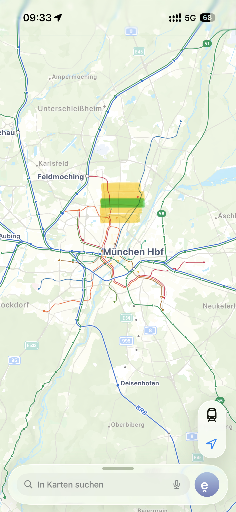
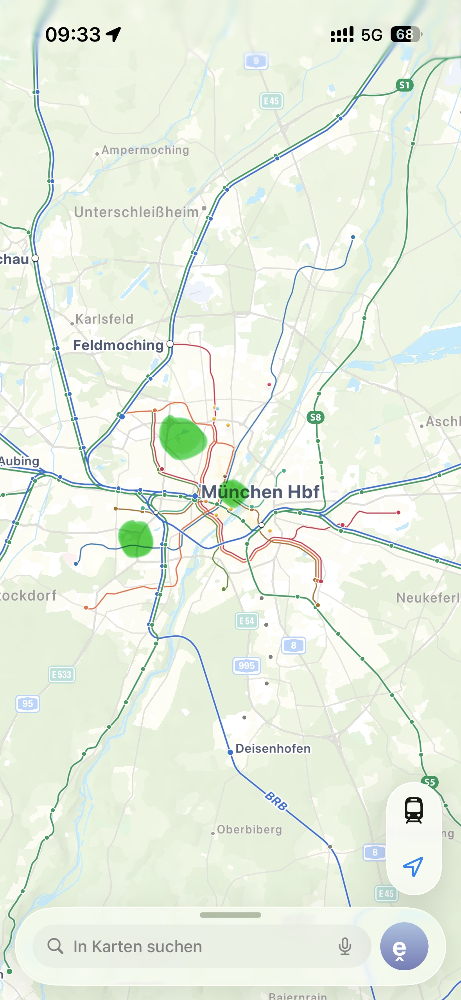

# 慕尼黑如何租房

在《指北》、《指南》、《指西》、《指东》四部曲后，随之而来的是新系列《**左传**》、《**公羊传**》、《**榖梁传**》三部曲。
不说俏皮话了，租房是留学的必备前置条件之一，**是华人不得不品鉴的一环**。在这里我可以很负责任的说，如果你在国内时经常使用xian鱼交易，整个的租房过程都会顺畅许多。
*在一切开始前，我需要再次强调最重要的一点。不论你在什么平台租房，一定不要脱离当前平台，与“房东”达成私下交易，这是大忌。*

## 慕尼黑租房左传

### 平台推荐

在这里我只推荐一个平台，供你们在国内时找房，即Immoscout24。十分不推荐找留学生的Nach房源，具体原因我会在之后一章详谈。
使用苹果的用户可以*切外区*，安卓的自行搜索*谷歌框架*相关内容，在此不多赘述。
这个软件的特点在于会收取用户一笔会员费。充值了会员的用户可以更早的看到优质房源，也会在和房东发消息时置顶。
仅论慕尼黑的环境，租房市场十分抢手，尤其是在每年两度的开学季。新发布的房源，地段和价格匹配的，几乎会在10分钟内被咨询满，是真正的手快有，手慢无。

> 简单交代一下租房的大致流程：
>
> 1. 你发一段消息给房东，大致介绍自己与对这套房子的兴趣，询问是否能看房。
> 2. 房东在自己初步筛选后回回复几个自己认为的优质房客，和你预约一个看房的Termin。
> 3. 线下看房，与房东大致交流一下。房东会问问你的经济情况和租房的大致时长。
> 4. 若是你在房东的最终心理评分表里排名第一，你会在大约两天后收到房东的意象回复，询问是否要这套房子。
>     大致便是这样子，在第三个环节线下看房中，房东有可能会一次性招待好几个看房的客人，这并不稀奇。
>

### 租房难？把思路逆转过来吧！

> 为什么留学生租房难呢，这里有若干个原因：
>
> **a**. 学生经济能力
> **b**. 外国公民在德国落户前无法提供Schufa信用证明
> **c**. 慕尼黑是全世界公认的最排外城市前五
> **d**. 如做菜油烟这些“刻板印象”
>
> 影响因素的重要性大概是由上至下依次递减。

针对这些问题，我们要在发送给房东的第一条消息中便尝试降低房东的抗拒风险。
在你的自我介绍中加入：
**a**. 学生有Sperrkonto和父母的金钱支持
**b**. 我可以在第一个月先一次性缴纳三个月的房租+押金，以证明我的经济能力（这一点看人，如果你一次性交不出来那就不写）
**c**. 独居，不玩乐器，不开Party
最后祈祷房东并不种族歧视。

如果你确实很难找到WG或是单人公寓，我建议你与同学一起整租包下一套房。**50m2的一室一厅+学校通勤半小时内**的房子暖租价格大致在1500-2000欧，价格据地段起伏。平摊下来比单人的成本还是低很多的。单人我建议看看地铁终点站附近的房子，30m2暖租1200应该可以挑到。

### 租房位置

来慕尼黑租房的大概率还是会去TUM，那我建议你在慕尼黑北方找房。因为大部分理工科专业都会有课在Garching，尤其是Informatik相关的。若是在慕尼黑南方，请做好通勤一小时的心理准备。此处的例外是医学系。

在这提供一些位置信息。
LMU主校区：U3/6 - Universität站
TUM主校区：U2 - Theresienstraße站
LMU数学系：U2 - Theresienstraße站
LMU医学系：U6 - Großhadern站
Garching则在U6 - Garching Forschungszentrum站
除了LMU医学系外，都是在慕尼黑靠北边的地方。
请打开地图。以U2 - Frankfurter Ring连线至U6 - Studentenstadt，这里的房源距两慕、Garching通勤都在20分钟左右，且有丰富的德超、亚超资源。十分适合中国宝宝。

当然，慕尼黑还有其他的宝藏地点，我也一并整理了。
Westpark附近、Olympiapark附近、Lehel附近。除Olympiapark外，通勤都会在20-30分钟内达Garching/主校区，Olympiapark离Garching略有距离。参见下图———

这里考虑性价比，若是不在乎钱，你可以在学校主校区对面直接租1500起价的单人公寓。通勤两分钟。
值得说的一点是，慕尼黑的公共交通十分甚至九分的方便，在Mzone内，你可以乘公共交通到任何地方。而德国的大部分城市都只有公交和电车。亚琛甚至没有电车。有地铁的城市已经是城上城了，但你慕尼黑还有S-Bahn，甚至RE都得在慕尼黑停两次才能开出城。

## 慕尼黑租房公羊传

这是本系列的**第二部曲**，主要谈谈**租到房后**的注意事项。

### 合同

首先，收到房东发来的合同后，一定要仔细研读，重点观察**押金**和房屋出现问题后的**处理方法**。
德国租房有一条臭名昭著的规定，即**Schönheitsreparatur**，要求房客在最终离开时完成一些本不应该由房客承担的义务，如重新粉刷墙壁、重新更换地板、窗户百叶窗的更换、电灯按钮的更换等等。以德国人工费，这一套可能会收取上千欧的费用。因此你需要仔细阅读合同中关于这部分的规定。

### 为什么Nach租房是屎？

上一篇中有一个伏笔，为什么我不推荐你住别人找Nach下家的房源。

*最近正好在玩《逆转裁判》，这个放在这里还挺合适的：*

不妨**把思路逆转过来吧**！不要去找“**我不推荐你去接别的留学生Nach房子的原因**”，而是去找“**别人为什么要Nach这套房的原因！**”
**只有**两个可能性：

1. 这套房子原来是**无家具的空房**，是**上一个人买的家具**。
2. 上一个人**不得不出Nach**。
   若是前者，那么你需要支付一笔不菲的家具买断金，且要在你搬出时也找到愿意接盘的人，若是没有，房东只会让你把这些家具通通自己带走，而这又会引向两个方向：**扔掉**或**带走**。扔掉的话，你需要支付垃圾处理厂一大笔费用来处理床、柜子、桌子；带走的话，你真能带走上面我说的三个东西吗？
   若是后者，那么上一个人出Nach的原因就很显而易见了。要么他遇到了上述的第一个情况，不得不找下家接家具。要么是另一个更坏的结果。

还记得我说了，德国有一项臭名昭著的Schönheitsreparatur规定吗。你可能会问，这和我有什么关系，前一个人不是搬走了吗？
而这恰恰就有关系。德国规定，Nachmieter会全权继承上一个房客的义务。即上一个房客没刷的墙，你走时要刷（或者说得更明白些，你和上一家实际上在法律上被视为一个人）；上一个房客可能弄坏了家具，但Nachmieter是你，你会继承房屋的状态，家具就变成了你弄坏的。如果你在搬走时未能找到下家，那么答案就很显而易见了，天价赔偿。
这些击鼓传花的房源在慕尼黑多的我已经不想吐槽了，十分甚至九分之多。
所以现在你可以理解为什么每年6月初就有很多留学生出Nach了吗？还是说你也想尝尝烫手的山芋甜不甜？看看这套房子究竟被Nach过多少次了？

在入住房子前，确定好合同后，请你与房东一起，拿着纸，做好Protokoll，把房子的每一处细节都记录下来，地板哪里原来就有一条划痕，卫生间地板和马桶的状态干净与否，厨房有没有任何东西的损坏，开关都正常吗，等等等等。都要记录在案，双方一起签名写日期留痕。一定，一定要这样做。

我会推荐你买一个Haftpflichtversicherung，中文名第三方责任险，万一你手滑打碎了洗手台，或是把灶台意外损坏了，都可以走这个保险赔付。但发霉、地板磨损等日常损耗无法报保险；更大一些的火灾、漏水也无法走这个保险。

## 慕尼黑租房榖梁传

写到这里，你应当清楚了如何租房与入住，这里谈谈搬出时怎样避免被扣下巨额押金。

### 救救你的押金

首先，搬出的交房日期不要定在合同的最后一天，房东也许会对部分清洁工作不满意，会要求你返工或扣押金，最后一天就没有余量了。

其次，你的卫生要打扫的十分干净，照着入住前的Protokoll确认每一处的具体情况。地板有没有椅子拖拽的痕迹，浴室有没有发霉，厨房烤箱有没有清理。请务必确保在你走后，房子正如同你走前那样整洁。此处也可联系当地的Putzfrau，花上几十至一百欧确保押金的安全。

### 克扣押金如何应敌

有人曾说过，一切XXX都是纸老虎。同理，若是你已经做好了一切的工作，房子在你走前走后维持一个状态，那你自然不用担心被房东苛扣押金。此处有两个解决方案：

1. 加入你所在城市的**租客协会Mieterverein**。慕尼黑的网站如[蓝链]([Mieterverein München e.V. - Sicherheit macht stark](https://www.mieterverein-muenchen.de/))。租客协会会在收取你月供的前提下保护你免受房东的胁迫。在房东有不合理请求的前提下，租客协会的律师会帮助你处理。
2. 买一个律师险，直接联系律师**起诉房东**扣下押金。

两者每月大致收取20欧至30欧的费用，且需要多年制订阅，不可中途取消。

但这一切的前提是你问心无愧，没有损坏任何家具，没有造成任何财产损失。
**若是真的有什么破坏，请不要打中国留学生的脸，给我去道歉然后付罚金啊！**

看到这里，你已经看到了这里，可以完成慕尼黑租房副本了。
2025年7月16日，写于去奥地利玩的Kindle上。
