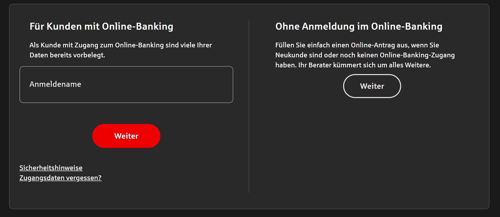
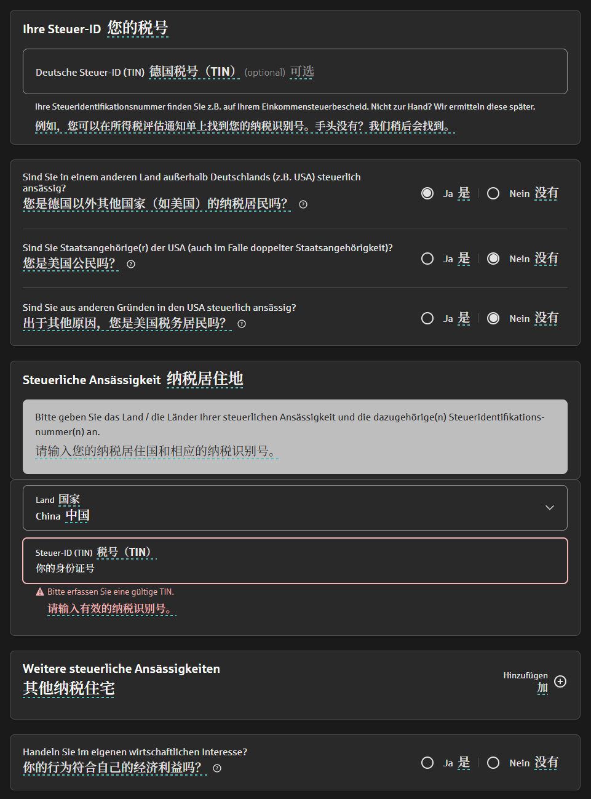

# 刚落地慕尼黑，我该怎么办

**又称——慕尼黑初期出装一览**

此文的目标读者是那些已经摆脱了找房压力的留德华们，正准备迎接慕尼黑这座在世界难融入城市榜单上赫赫有名的基督教大本营。

> 引用马克-吐温在 1878 年谈到在慕尼黑时说的话：
> München schien der schlimmste, verlassenste, unerträglichste Ort zu sein – die Zimmer so klein, der Komfort so dürftig – unausstehlich,
> 慕尼黑似乎是最糟糕、最冷清、最令人难以忍受的地方--房间如此之小，舒适度如此之低--令人难以忍受。

看来1878年的慕尼黑就已经有了今日的风采了。

## 银行卡办理

初来德国，银行卡办理是重中之重，有了银行卡，你才可以延签、办理交通月卡、不必带着一背包硬币出入。

在这里推荐两处银行可供办理银行卡——Sparkasse München与Comdirect。前者在慕尼黑随处可见，且Sparkasse遍布全德，后者是德国商业银行Commerzbank旗下的子银行，也较为知名。且两者都是免管理费的。

本文仅详细展开如何在Sparkasse办理借记卡。
### Sparkasse开户

我在此推荐Sparkasse的[Jugendkonto | Stadtsparkasse München](https://www.sskm.de/de/home/privatkunden/girokonto/girokonto-start.html)，免管理费，且会给你一张既有Maestro（德国的支付途径，类比银联）也有Mastercard，可供你在全球刷卡支付。

在通过小蓝链跳转后，会进入如下界面：

请点击右侧“Ohne Anmeldung im Online-Banking”，进入如下的信息填写页面，前面的内容没有争议，如实填写就可以了，最后的内容请按图片所示填写，不得有偏差。

其中“Steuer-ID”会在anmelden之后由税务局通过信件形式寄送给你，但此处可省略不填，Sparkasse会在系统内自动帮你寻找属于你的税号，你只需要填写中国内的税号就行了（即你的身份证号码）。
最后一项Handeln Sie im eigenen wirtschaftlichen Interesse?处，请勾选“Ja”。
此处的浏览器翻译插件请参考我在DSDⅡ直通车项目中的“[附④：我看不懂德语怎么办]()”，在那里有详细介绍。

在网上填报完成后，你可选择线上/线下验证个人身份，线上就是在App内与工作人员互动，需要你手持自己的护照摆姿势。线下则是前往Sparkasse的站点。学生验证身份请去**Barerstr. 41**这一家Sparkasse的站点，此处专门负责学生的业务。
在办理过程中，可能会遇到工作人员推荐你购买Haftpflichtversicherung，即第三方责任险，**请拒绝**，Sparkasse的合作方给予的是最不好的价格，哄骗你签两年的合同。

在你线上填报完成之后，会得到一个PDF文件，其中会拿到你的IBAN号码，可在拿到实体卡前先使用此IBAN号办理交通月卡/国内转账。

## 交通月卡购买

伟大的**朔尔茨爷爷**为德国人民带来了Deutschlandticket，对于留学生来说，这意味着我们每个月花38欧元（2025年5月26日），就可以享受**整个德国境内**的短途火车/公共交通。此包括所有城市的Bus、Tram、U-Bahn、S-Bahn，以及绝大多数的RE、BRB列车（除北威州部分跨国列车外，具体可在[此网页](https://www.bahn.de/faq/deutschlandticket-verkehrsmittel-deutschland)上找到）
举个例子，短途上，你可以在慕尼黑市内**随便**坐公共交通；中长途上，你可以在慕尼黑一路通过RE前往捷克的**布拉格**，或是奥地利的**因斯布鲁克**，且这么一趟好几个小时的列车是免费的。**朔尔茨爷爷**的恩情还也还不完啊！
我个人就经常在周末或者Vorlesungsfrei阶段乘车前往巴伐利亚的几个大湖区徒步（Tegernsee、Starnberger See、Ammersee、Walchensee），甚至很知名的景点地区，如楚格峰、国王湖、新天鹅堡都可通过此月票前往。（但景点内的旅游公交还是得自费）

扯远了，具体购买流程如下：
前往[此网站](https://www.mvg.de/abos-tickets/abos/ermaessigungsticket.html)，  点击“Hier bestellen”，在接下来的若干个表格中填上所有的信息。网站会通过你的学校网页来确认你的学生身份。
请注意不要买错，我们要购买的是38欧每月的Ermäßigungsticket，而非58欧每月的Deutschlandticket，这是**朔尔茨爷爷**用下台换来的学生福利价啊！

##  所有的物品购置

在本章节内，我会从日常的饮食，聊到家具，再到服装。

###  家具

在此我还是推荐**宜家**，宜家可能是最适合留学生租房的购置家居平台了。请下载IKEA的官方App，在其中你可以找到国内宜家拥有的一切（但欧洲宜家新品上的很慢，甚至连宜家本部都没有国内快）。慕尼黑的宜家都在很郊区的地方，我还是比较建议使用上门配送的服务（DHL），或者若要买很多东西，也可租车自己开着去进货。（中国驾照可以在德国短暂用6个月）

另外的选择有来自荷兰的品牌Action、来自丹麦的JYSK，这两个的价格可能会略微低一些，Action给我一种义乌的感觉。

### 饮食

德国的超市大致有以下几所：

**REWE**，中高端超市，种类较为齐全。
**PENNY**，廉价打折品超市，别去这里买肉。

**Lidl**，中低端超市。
**Kaufland**，大型卖场，啥都有，甚至有羊肉和猪五花肉。

**EDEKA**，高端超市。
**Netto Marken-Discount**，廉价打折品超市。

**Aldi Nord / Süd**，中低端超市。

**Norma**，中低端超市。

其中颜色相同的是同一个集团的，货品的来源很大程度上一致。

在这里，我必须负责任的为各位科普一下德国的肉类养殖，DSD的教学中大家应该都听说过‘Haltungsform’，这点可以从下图中看出。

大致上分为一至四级，在此之上可能还有BIO，其中一最差而四（BIO）最优，这代表着动物们生活的标准，也很大程度上意味着肉类的**腥臊程度**。我个人的味觉认为，鸡肉二级、牛肉一级、猪肉三级是我能接受的最低标准，尤其是猪肉，德国养猪是不阉割的，这使得绝大部分的猪肉都有一股“**骚味**”，像是猪在你的碗里还活着，还在对你哼哼叫。学生物和化学的同学们可以解释一下这个来源于哪里。低等级的猪肉骚味扑鼻而来，毫不夸张地说，第一次吃到二级猪肉时，我的心中顿然生出了以后信仰伊斯兰，不吃猪肉的念头。

请**千万**，**千万**，别买三级以下的猪肉！

亚洲的各种调味品如今已能在德国超市内找到：几乎所有的超市都有米饭。在家周围没有亚洲超市的前提下，你也可以前往**REWE**或**Kaufland**购买所需的调味料如酱油和醋。当然亚洲超市是更好的选择了。慕尼黑的话有Go Asia较为知名。

网购的话，可以选择京东海外版[**Ochama**](https://www.ochama.com/)，或是[**打酱油**](https://www.dajiangyou.eu/)，二者皆有很大的亚洲零食选择。

### 服装

来德国的各位不一定带够了服装，这里推荐一个平台。来自中国的平台[**Shein**](https://de.shein.com/)，就把它看作买衣服的淘宝问题也不大。其他的我并不是很了解，可以自行去看看捏。

## 电话卡

我不建议各位选择国内那些德国电话卡的实体卡，基本上都是商家售卖Vodafone的预付卡，这本质上没有很大的问题，但还是来德国后再办理为佳。使用国内的电话卡购买几天境外流量就好了，像是我的电信每年还送接近两周的境外不限流量，具体活动自行查找呢。

德国有且仅有三家运营商：**Vodafone**沃达丰、**Telekom**德国电信与**O2**。
这个Vodafone和Telekom就是你们想的那两家电信公司，在上个世纪铺遍了全球，英联邦都在用英国的Vodafone，Telekom更是铺遍了美国。
其中，O2口碑最次，Vodafone和Telekom五五开。
信号上，Telekom是无疑最好的，另外两个五五开；
价格上，O2和Vodafone会便宜不少。请自行选择你心仪的套餐呢。

电话卡一共有两种形式：预付卡和合同卡。

### 预付卡

顾名思义，这种电话卡可以在德国的超市里见到，Vodafone的最常见，10欧可以买到28天的10GB，需要买回家后根据说明**线上视频验证**并激活。

有些时候你可能会看到品牌是Ja！，Lidl Connect，EDEKA Smart，Kaufland Mobil这类的电话卡，这些是超市自营的牌子，但本质上还是Vodafone、Telekom和O2的**运营商**，只是在流量和速率上会有所不同。

###  合同卡

在慢慢定居下来后，有了自己的银行卡账户，我十分建议你去签约一个合同卡。这里推荐的平台是**Check24**，这是一个比价的平台，会列出各种合同的价格和细则。
老规矩，这里是[小蓝链](https://handytarife.check24.de/vergleich?context=sim)。

在中国大陆购买的iPhone和Galaxy都是没有eSim的，请跳过那些标注了eSim的合同卡。

这里讲几个比较重要的内容，一般流量下方会标注例如“bis 50 MBit/s”的速率，请注意Bit和Byte的换算：1Byte = 8 Bit，一般若是你没有在外下载电影的习惯，50 MBit/s也够用了。

大部分卡都会标注5G，但也有少数会标记LTE，这说明这些电话卡只支持到4G的信号，并不会连上5G的波段，对使用体验影响较大，不建议购买。

有些合同会允许你进行**Rufnummernmitnahme**，这代表着你可以在新合同继承上一个电话号码（哪怕是预付卡的号码），这对我们还是较为友好的，若是更换了新的号码，则很多平台都要手动更改手机号，较为麻烦。

合同的优势在于价格。明显会比预付卡的价格低廉上一些，但劣势在于，在合同期内无法取消。这点自己衡量吧。我目前使用的是Telekom运营的40G每月，按照国内的使用习惯选择的，但明显有些过多了，大家选择20G每月的就差不多了。学校内、大部分火车上，都会有公共的免费WiFi。

最后要注意的一点是欧盟漫游，大部分的电话卡都会支持你在欧盟各国内照常使用，但这不包括瑞士。若是有去瑞士游玩的计划，请注意自己的套餐覆盖范围。漫游的费用非常恐怖，在瑞士内用1GB会让你付出上千欧的代价。

## 保险

我知道各位会问：我都有医保了还要什么保险啊？

答案是Hausratversicherung住房保险和Haftpflichtversicherung第三方责任险，前者并不是必备的，保险范围是：房子着火、被水淹、电网损坏等；后者较为关键，若是你弄丢了房屋的大门钥匙，你需要为整栋楼的大门、地下室的门、停车场的门更换锁，按德国的人工费一次会要支付几百至一千欧元。而这个保险可以为你承担此费用。

### 第三方责任险

该保险旨在赔偿第三方人身或财产损失，如：

* 你不小心撞倒了别人的手机，导致手机损坏；
* 你骑自行车撞到了行人，对方受伤；
* 你家里的水管漏水，影响了楼下邻居的房屋；
* 你的孩子在公园玩耍时打碎了别人的眼镜；
* 你把我的相机碰倒了……

等等等等，业务很宽泛，且保费每个月也就个位数的欧元，比较值得购买。

小某书上有些人会说这个保险可以帮你赔付退租时房东扣押你的押金，我亲身体验下来，实际上很难做到。首先，第三方责任险只赔付一瞬间内造成的损失。而在租房上，地板的磨损、浴室的折旧、墙壁上的掉漆都不属于“瞬间”的定义，而是慢慢形成的损伤。房东可能会要求你支付这些的赔偿，但保险公司会直接拒保。

同样的，此保险也可在Check24上比价，[链接在此](https://www.check24.de/privathaftpflicht/#vergleich)。

### 律师险

该保险旨在报销你咨询律师/打官司的费用。

大家都能想到，德国律师费肯定会很贵，一小时咨询就要上百欧元，让律师写所谓催债的Mahnungsbrief，或是为你辩护，更是数不尽的金钱。律师险旨在为你解决此类问题。

其实律师离我们并不算遥远，房东扣留押金是德国特别特别常见的一项，德国法律规定房东可以至多收取你三个月租金的押金，而退还时限有足足退租后的一整年，甚至可以以调查账单为由继续延长。此时律师可以为你写Mahnungsbrief，催促房东归还押金，并以起诉相威胁。大多房东此时便会退还你的押金了。

但此保险对于我们的价值并不高，在此仅是介绍，不做推荐。

## 生活调味剂

至于其他的点点滴滴，这里引用慕尼黑大学的[官网指南](https://www.lmu.de/de//die-lmu/arbeiten-an-der-lmu/zusaetzliche-angebote/dual-career-service/leben-in-muenchen/)。

没有其他地方能像慕尼黑这样，既有迷人的工作环境，又有令人兴奋的休闲活动。

迷人的建筑，艺术、技术、设计和制图领域的重要藏品，舒适的啤酒花园，再加上阿尔卑斯山的山峰和近在咫尺的众多湖泊，让慕尼黑的生活充满惬意。从官邸和宁芬堡宫到奥林匹克运动会场、巴伐利亚电影之旅和 Hellabrunn 动物园，慕尼黑有许多值得一游的地方。

此外，慕尼黑还有丰富多彩的戏剧节目和充实的成人和儿童活动日程表，从三月的烈性啤酒节到夏季的电影节和歌剧节、秋季的啤酒节和冬季迷人的圣诞集市，每个人都能找到适合自己的活动。

###  艺术与人文

慕尼黑的文化活动丰富多彩。如果您想了解更多音乐、文学或艺术方面的信息，可以访问慕尼黑[市政府](http://www.muenchen.de/Stadtleben/Kultur_Unterhaltung/87825/index.html)和[文化局](http://www.muenchen.de/rathaus/Stadtverwaltung/Kulturreferat.html)的网站。此外，我们还为您精选了慕尼黑的各种文化活动。

- [展览](http://www.muenchen.de/Stadtleben/Kultur_Unterhaltung/Museen_Ausstellungen/ausstellungen/106398/index.html)
- [展览中心](http://www.muenchen.de/sehenswuerdigkeiten/museen.html)
- [图书馆](http://www.muenchen.de/leben/bibliotheken.html)
- [巴伐利亚电影城](http://www.filmstadt.de/)
- [巴伐利亚广播公司](http://www.br-online.de/)
- [慕尼黑电影城](http://www.muenchen.de/veranstaltungen/film-medien/institutionen-bildungseinrichtungen/filmstadtmuenchen.html)
- [电影放映计划](http://www.muenchen.de/kino.html)
- [画廊](http://www.muenchner-galerien.de/)
- [巴伐利亚国家歌剧院](http://www.bayerische.staatsoper.de/)
- [音乐会](http://www.munichx.de/hoeren/)
- [音乐场景](http://www.muenchen.de/Stadtleben/Kultur_Unterhaltung/Musik_Konzerte/Musik_kaufen/106542/index.html)
- [城市导游和观光之旅](http://www.muenchen.de/Tourismus/Stadtfuehrungen_Touren/Stadtfuehrungen/132196/index.html)
- [城市博物馆和收藏品](http://www.muenchen.de/rathaus/Stadtverwaltung/Kulturreferat/Museen-Galerien.html)
- [剧院](http://www.muenchen.de/veranstaltungen/events/theater.html)
- [慕尼黑大学举办的活动](https://www.lmu.de/de//newsroom/)

### 慕尼黑景点

为了帮助您全面了解慕尼黑，方便您做出选择，我们将慕尼黑最重要的景点归纳为以下几点。

- [历史和公共建筑](http://www.muenchen.de/Stadtleben/Kultur_Unterhaltung/Sehenswuerdigkeiten/Historische_Gebaeude/87704/index.html)
- [教堂和修道院](http://www.muenchen.de/sehenswuerdigkeiten/kirchen-kloester.html)
- [市场](http://www.muenchen.de/sehenswuerdigkeiten/maerkte-uebersicht.html)
- [博物馆](http://www.muenchen.de/sehenswuerdigkeiten/museen.html)
- [公园和花园](http://www.muenchen.de/Stadtleben/Kultur_Unterhaltung/Sehenswuerdigkeiten/Gaerten_Parks_und_Friedhoefe/87728/index.html)
- [广场、喷泉和纪念碑](http://www.muenchen.de/rathaus/Stadtverwaltung/baureferat/oeffentlicher-raum/gestaltung-oeffentlicher-raum.html)
- [城堡和要塞](http://www.muenchen.de/Stadtleben/Kultur_Unterhaltung/Sehenswuerdigkeiten/Burgen_und_Schloesser/87699/index.html)
- [塔楼、城门和大厅](http://www.muenchen.de/Stadtleben/Kultur_Unterhaltung/Sehenswuerdigkeiten/Tuerme_Tore_und_Hallen/87723/index.html)

您还可以在慕尼黑市网站上了解其他景点。

### 运动与休闲

您是否正在为自己和家人寻找合适的运动或令人兴奋的休闲活动？请访问慕尼黑市或慕尼黑成人教育中心的网站。

以下是我们为您精心挑选的一小部分：

* [慕尼黑地区的游览目的地](http://www.muenchen.de/freizeit/ausfluege/umland.html)

- [安联球场](http://www.allianz-arena.de/de/index.php)
- [湖泊](http://www.muenchen.de/freizeit/seen-uebersicht.html)
- [奥林匹克公园](http://www.olympiapark-muenchen.de/)
- [游泳池](http://www.muenchen.de/Tourismus/Sport/M_Baeder/77963/index.html)
- [海洋生物](http://www.visitsealife.com/)
- [慕尼黑体育办公室](http://www.muenchen.de/rathaus/Stadtverwaltung/Referat-fuer-Bildung-und-Sport/Sport.html)
- [海拉布伦动物园](https://www.hellabrunn.de/)
- [周边游](http://www.muenchen.de/Tourismus/Umland-Guide/Freizeit_Erlebnisse/172137/index.html)
- [公众节日](http://www.volksfestkalender.de/)
- [慕尼黑天文台](http://www.sternwarte-muenchen.de/)
- [游戏公园](http://www.wildpark-poing.de/)
- [慕尼黑中央大学体育中心](http://www.zhs-muenchen.de/)

**顺便提一句，马克-吐温的名言是这样说的：**

> *„Aber am nächsten Morgen verliebten wir uns in die Zimmer, das Wetter, München und Hals über Kopf in Fräulein Dahlweiner.“*
>
> *"但第二天一早，我们就爱上了这里的房间、这里的天气、这座城市"，也爱上了达维纳小姐"*

