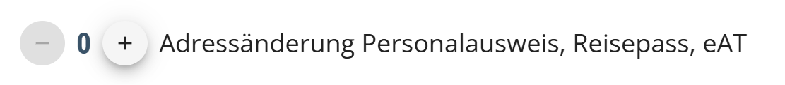
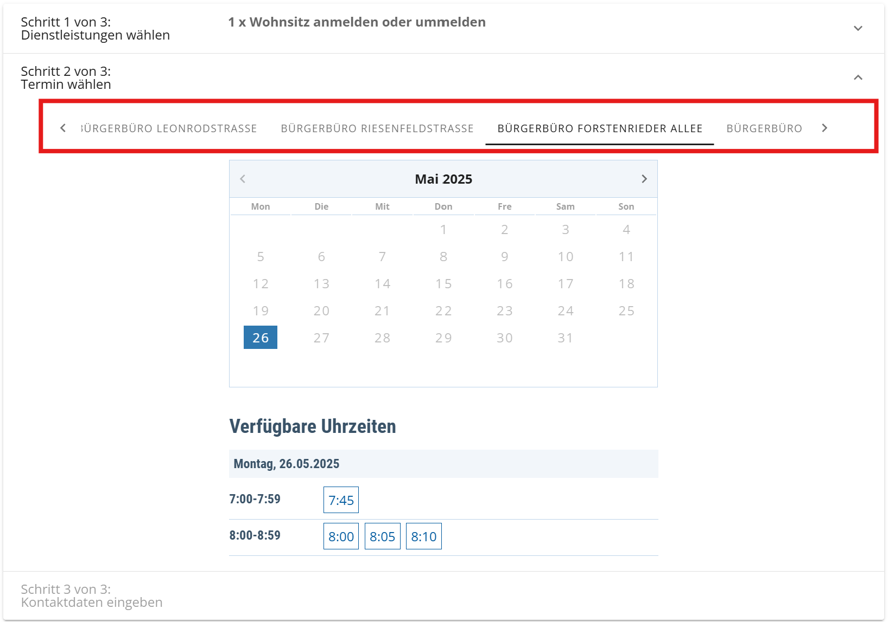

# 慕尼黑落户指南（Anmelden）

## 背景知识

在德国生存下去，租到房子后的第一件事便是落户。[合约电话卡]()、[部分银行卡]()、[延签]()的办理都需要提供所谓的Meldebescheinigung，也就是落户后当场提供给你的一张纸。上面会标注你的姓名、生日、住址。

## 预约落户

与在德国干任何事一样，你需要预约一个Termin才可落户，可在Google上搜索”München anmelden“来获取链接，我这也会按惯例附上[小蓝链](https://stadt.muenchen.de/buergerservice/terminvereinbarung.html#/services/1063475/#/services/10295182/)，可点击即刻跳转。
在跳转后，你会进入一个选择服务的界面，~~成年人的世界自然是多多益善，统统勾上！~~，一般而言我们不需要去勾选以下的任何一项，但若是你已经获得了居留卡*（但都获得了居留卡还有必要看我的教程吗？）*，可勾选如下一项，工作人员会帮你打印一个补丁并贴在你的居留卡上。

在前往下一个选择Termin的界面后，你会看到如图所示的情况。

若当前界面显示“**Keine freien Termine verfügbar.**”，请注意图上我用红框框选的部分，你可以选取在不同的办公处办理，每个办公处的Termin是独立的，一般而言“Ruppertstraße”作为最大的办公处，所提供的Termin是最多的，但更重要的是，请选择离家较近的办公处。在工作日一来一回花费的时间不太值得。

若没有Termin，换一个时间点再刷刷就好了，目前的Anmelden名额还是给的很宽松的。

在选取好时间段后，你需要填写你的姓名和邮箱，并会在邮箱内收取一封确认信，请点击Bestätigen完成确定，否则在30分钟后会算作自愿放弃名额。

## 现场办理

在Termin的当天，请带好你的护照+Wohnungsgeberbestätigung，该证明文件会由你的房东交给你，上面会有房东和你的部分信息，请把它与护照共同交给现场办理的雇员。

在此会有一个小插曲：
若是住所邮箱上面并没有你的名字，请一定要告诉办理的雇员这点，并把care of的信息一并告知雇员。此类情况一般发生在搬入某些WG后，或是当前的房东不允许你更改信箱上的名称。

在办理完成后，你会在现场拿到一份Meldebescheinigung，在办理银行卡时请带着它，不一定有用，但有可能需要。
你可能会在办理图书馆借书卡时也被要求出示此证明，例如在现场办理LMUCard时，会要求你一并出示此证明。

## 电视许可费

后续会有慕尼黑交通协会的广告信与**收取电视费**的信件寄来，后者相当重要，请牢记上方的**Aktenzeichen**，并前往电视许可费的[官方网站](https://www.rundfunkbeitrag.de/)进行上报，会要求提供你的银行卡号通过SEPA每月/季度支付费用。
在上报完成后，你会收到第二封写有你的**Beitragsnummer**的信，请记住此号码。

若你住在WG内，则需要与舍友们分摊电视费，请直接向舍友索取Beitragsnummer并约定定期向他们转账，将自己的Aktenzeichen绑定到他们的Beitragsnummer上即可。

这里解释一下电视费的机制——
电视费在理论上是每家住户不论有没有电视都要交的每月费用，但在实际执行上，它是一项人头费。
当你在Anmelden的同时，德国的负责部门会同时生成一份你的Aktenzeichen，这个数字是与你进行绑定的，哪怕你进行过Ummelden，这个数字也保持不变。你需要做的是为这份Aktenzeichen找到一个Beitragsnummer。
若你**独居**，则需要在网站上报并自己缴纳费用。但若是你住在**WG**内，你的舍友们已经上报过电视费的前提下，他们已经拥有了一份Beitragsnummer，你只要从他们那获得并将自己的Aktenzeichen绑定在他们的Nummer上就够了。

希望阐释的足够清楚了。

在此小小庆祝一下此博客系列在本篇完结后突破了万字！
庆祝结束。
