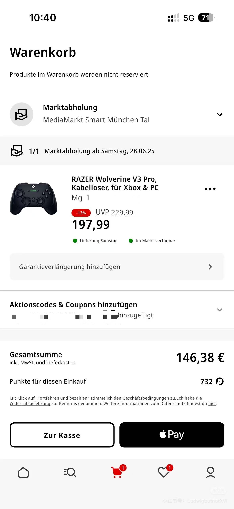

# 🇩🇪在德国购买手柄比国内便宜？

标题党了，德国购买绝大多数手柄都是比国内贵的，包括御三家巨硬的精英2、嗦你的DSE，更不用提Gamesir、Flydigi、EasySMX这些国内的牌子了。
但我想买一个雷🐍的幻影战狼3Pro，国内jd国补后仍要1300，tb一些专卖店也是这个价格。
最近正好德国Mediamarkt有-19%增值税的活动，叠加用10000积分换的10欧元券和UNIDAYS大学生送的10欧元券后已经来到了146.38欧元的好价，这么算来，就算以目前欧元8.4的高价也只有1200人民币，如果你是在今年年初兑的7.5欧元，更是只有1000余元的好价，也就是国内xbox精英2目前的价格。

当然这只是一个思路分享，不仅限于这款手柄。但Mediamarkt目前的活动覆盖范围不算很广，只涵盖了显示器、吹风机、手柄主机等一系列产品，若是像我一样臭打游戏的还是值得看一看的，在德国没什么机会买到和国内差不多价格的电器了。